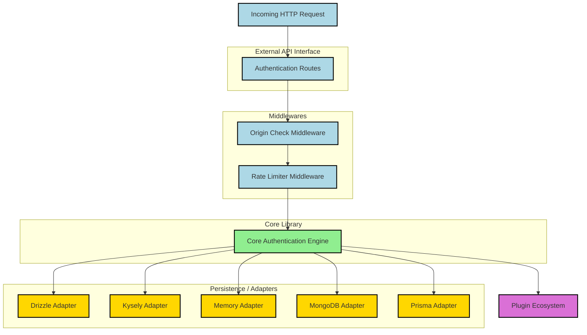

# Contributing to Better Auth

Thanks for taking the time to improve Better Auth! This is a small document to get you started.

Please refer to the [getting-started documentation](https://better-auth.com/docs/contribute/getting-started) specific to contributing for more information.

## Security Issues

If you see any security issue we prefer you to disclose it via an email (security@better-auth.com). All reports will be promptly addressed, and you'll be credited accordingly.

Learn more about our [security issues documentation](https://better-auth.com/docs/contribute/security-issues).

## A Few Guidelines to keep in mind

- Rather than extensive configurations, focus instead on providing opinionated, best-practice defaults.
- Try to make a consistent and predictable API across all supported frameworks
- Everything should be type-safe and embrace typescript magic when necessary.

## Development

Read more about development in the [getting-started documentation](https://better-auth.com/docs/contribute/getting-started#development-setup).

1. Fork the repo
2. clone your fork.
3. install node.js (preferable latest LTS).
4. run `cp -n ./docs/.env.example ./docs/.env` to create a `.env` file (if it doesn't exist)
5. run `pnpm i` in your terminal to install dependencies.
6. create a branch.
7. build the project using `pnpm build`
8. run `pnpm -F docs dev` (to run the docs section)
9. create a draft pull request. link the relevant issue by referring to it in the PR's description. Eg.closes #123 will link the PR to issue/pull request #123.
10. implement your changes.

## Testing

Read more about testing in the [testing guide](https://better-auth.com/docs/contribute/testing).

## Architecture

