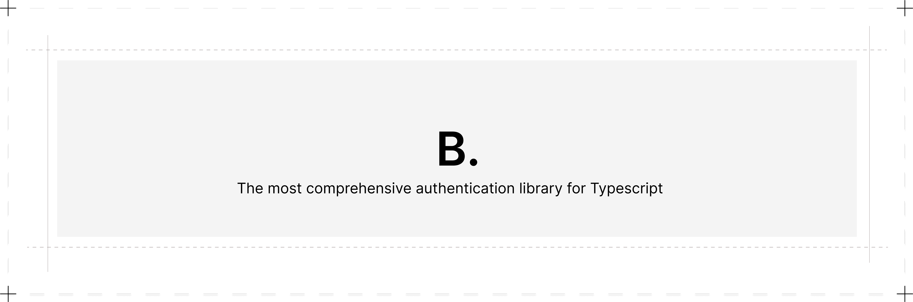

<p align="center">
  <picture>
    <source srcset="./banner-dark.png" media="(prefers-color-scheme: dark)">
    <source srcset="./banner.png" media="(prefers-color-scheme: light)">
    
  </picture>
  <h2 align="center">
    Better Auth
  </h2>

  <p align="center">
    The most comprehensive authentication library for TypeScript
    <br />
    <a href="https://better-auth.com"><strong>Learn more »</strong></a>
    <br />
    <br />
    <a href="https://discord.com/invite/GYC3W7tZzb">Discussions</a>
    ·
    <a href="https://better-auth.com">Website</a>
    ·
    <a href="https://github.com/better-auth/better-auth/issues">Issues</a>
  </p>
</p>

[](https://www.npmjs.com/package/better-auth)
[](https://github.com/better-auth/better-auth/stargazers)

> **Note:** 🚧 This project is currently in beta. Features and APIs may change.

## About the Project

### Why Better Auth?

> Auth feels like a partially solved problem in the ecosystem. Existing open-source libraries often require a lot of additional code for anything beyond a simple login. Third-party services, while convenient, comes with their own set of problems. And obviously, these services aren't free and can get really expensive. 

> Better auth is born out of these frustrations. It aims to provides a comprehensive authentication library from the core accompanied by a growings plugin ecosystem, that allows you to add many auth related features in short amount of time.


### General Goals

- **Be Comprehensive**: The goal is to save users from reinventing the wheel for anything realted auth.
- **Prioritize Best Practices**: provide best practices rather than overwhelming users with configuration options.
- **Framework Agnostic**: The aim is to be friendly to all frameworks and try to avoid framework-specific solutions and features as much as possible.
- **Consistance**: Provide a consistent and predictable API.
- **Embrace Type Safety**: Value type-safety. Embrace typescript magic when necessary.

### Features

- Framework Agnostic
- Email & Password
- Account & Session Management
- Built In Rate Limiter
- Automatic Database Management
- Social Sign-on
- Organization & Access Control
- Two Factor Authentication
- Plugin Ecosystem and more...

### Installation

```bash
npm i better-auth
```

## Documentation

https://better-auth.com/docs