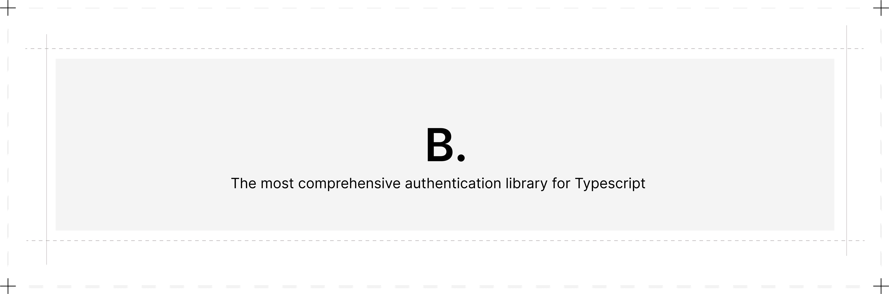

  <picture>
    <source srcset="./banner-dark.png" media="(prefers-color-scheme: dark)"/>
    <source srcset="./banner.png" media="(prefers-color-scheme: light)"/>
    
  </picture>
  <h2 align="center">Better Auth</h2>
  

    The most comprehensive authentication framework for TypeScript
     
    <a href="https://better-auth.com"><strong>Learn more →</strong></a>
      
    <a href="https://discord.gg/better-auth">Discord</a>
    ·
    <a href="https://better-auth.com">Website</a>
    ·
    <a href="https://github.com/better-auth/better-auth/issues">Issues</a>
  

  
  
  

## About

Better Auth is a framework-agnostic authentication library for TypeScript. It provides a comprehensive set of features including 2FA, multi-tenant support, and a plugin ecosystem that lets you add advanced functionality with minimal code—so you can focus on building your application instead of reinventing authentication.

## Why Better Auth

Authentication in the TypeScript ecosystem is a half-solved problem. Most libraries require significant additional code beyond basic auth. Better Auth provides a complete, open-source solution that saves you from managing third-party services.

## Contributing

Better Auth is MIT licensed. You can help by:

- [Contributing code](./CONTRIBUTING.md)
- [Suggesting features and reporting issues](https://github.com/better-auth/better-auth/issues)

## Security

Report security vulnerabilities to [security@better-auth.com](mailto:security@better-auth.com). All reports will be promptly addressed and credited.
