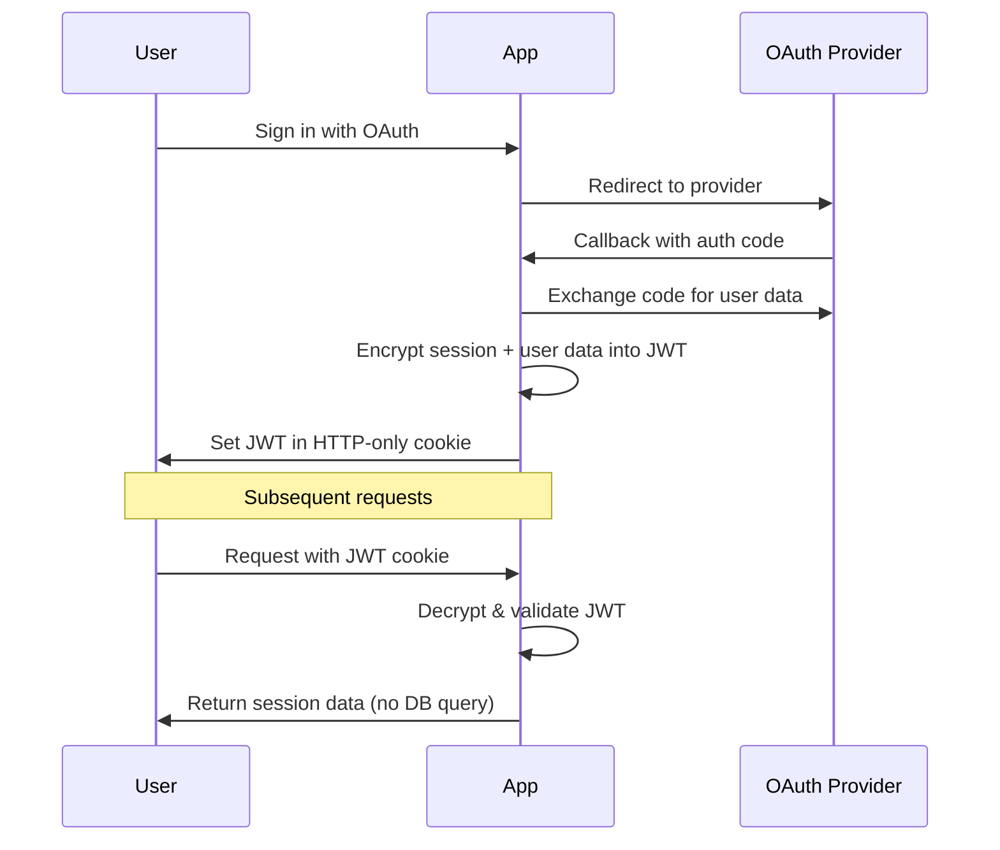

<Callout type="warn">
**Security Warning**: When running without a database, stateless sessions cannot be revoked server-side. Sessions will remain valid until their JWT expires. Only use database-free mode if you understand the security implications and your use case doesn't require immediate session revocation.
</Callout>

Stateless session management stores session and user data in encrypted JWT cookies, enabling session validation without database queries. This approach can work **with or without a database**, giving you flexibility in your architecture.

## Two Modes of Operation

### Mode 1: JWT + Database (Recommended)

```ts
// Fast reads from JWT, full control with database
export const auth = betterAuth({
    database: myDatabaseConfig, // Database configured
    session: {
        cookieCache: {
            enabled: true, // JWT for fast reads
        },
    },
});
```

**Benefits:**
- ✅ **Fast session reads** - No database query for `getSession()`
- ✅ **Full session management** - Can revoke, list, manage sessions
- ✅ **Email/password auth** - Supported
- ✅ **Best of both worlds** - Performance + Control

### Mode 2: JWT Only (No Database)

```ts
// Fully stateless - no database required
export const auth = betterAuth({
    // No database configured
    session: {
        cookieCache: {
            enabled: true, // JWT only
        },
    },
    advanced: {
        oauthConfig: {
            storeStateStrategy: "cookie", // Required for no-DB mode
        },
    },
});
```

**Benefits:**
- ✅ **No database needed** - Eliminate database entirely
- ✅ **Maximum scalability** - Works across any number of servers
- ✅ **Simple infrastructure** - Just application servers, no DB
- ❌ **Limited features** - No session revocation, password auth, etc.

<Callout type="info">
**Recommendation**: Start with **Mode 1 (JWT + Database)** for most applications. Only use Mode 2 if you truly need to eliminate the database and understand the trade-offs.
</Callout>

## When to Use Stateless Sessions

### Best For

**With Database:**
- Applications wanting **fast session reads** (no DB query) while keeping full session management
- Hybrid approach: Performance of JWT with control of database sessions
- Gradually migrating to stateless architecture

**Without Database (True Stateless):**
- **High-traffic applications** that need to scale horizontally across multiple servers
- **Serverless deployments** where database connections are expensive or limited
- **Edge computing** where low latency is critical
- **Multi-region deployments** without shared database infrastructure
- **Read-heavy workloads** where session validation happens frequently
- **OAuth-only applications** that don't need password authentication

### Not Suitable For

<Callout type="error">
**Do not use database-free stateless mode if:**
- Your application requires **immediate session revocation** (e.g., banking, admin panels, security-critical apps)
- You need to **list or manage user sessions** across devices
- You want to use **password-based authentication**
- Compliance requirements mandate **server-side session control**

**Note:** If you need these features, use `cookieCache.enabled: true` **with a database** instead. You'll get fast JWT reads plus full session management capabilities.
</Callout>

## How It Works



### Key Benefits

1. **Zero Database Queries**: Session validation happens entirely in-memory by decrypting the JWT
2. **Horizontal Scalability**: Works seamlessly across multiple servers with no shared state
3. **Reduced Latency**: No network round-trip to database for every request
4. **Simplified Infrastructure**: No need for session storage or replication

### Trade-offs

1. **No Revocation**: Once issued, a JWT remains valid until expiration - you cannot invalidate it early
2. **Larger Cookies**: Session data is stored in the cookie (typically 1-4KB encrypted)
3. **OAuth Only**: Email/password authentication is not supported in stateless mode
4. **Limited Session Management**: Cannot list active sessions or force logout from all devices

## Basic Configuration

Enable stateless sessions by setting `cookieCache.enabled` to `true`:

```ts title="auth.ts"
import { betterAuth } from "better-auth"

export const auth = betterAuth({
    secret: process.env.BETTER_AUTH_SECRET, // Required - min 32 characters

    // OAuth providers only (email/password not supported)
    socialProviders: {
        github: {
            clientId: process.env.GITHUB_CLIENT_ID!,
            clientSecret: process.env.GITHUB_CLIENT_SECRET!,
        },
        google: {
            clientId: process.env.GOOGLE_CLIENT_ID!,
            clientSecret: process.env.GOOGLE_CLIENT_SECRET!,
        },
    },

    session: {
        cookieCache: {
            enabled: true, // Enable stateless JWT sessions
            maxAge: 5 * 60, // Cache for 5 minutes (optional)
        },
        expiresIn: 60 * 60 * 24 * 7, // 7 days
        updateAge: 60 * 60 * 24, // 1 day
    },

    // Required: Store OAuth state in cookies
    advanced: {
        oauthConfig: {
            storeStateStrategy: "cookie",
        },
    },
});
```

<Callout>
**Database Optional**: With stateless sessions enabled, you can run Better Auth without a database. User data from OAuth is stored only in the JWT cookie.
</Callout>

## Advanced Configuration

### Custom JWT Encoding

The `cookieCache.enabled: true` configuration uses Better Auth's built-in JWT encryption automatically. For most use cases, this is sufficient and secure.

If you need custom JWT handling, you can implement it at the application level by intercepting session data:

```ts title="auth.ts"
import { betterAuth } from "better-auth"

export const auth = betterAuth({
    session: {
        cookieCache: {
            enabled: true, // Uses built-in JWE encryption (A256CBC-HS512)
            maxAge: 5 * 60, // 5 minute cache
        },
        expiresIn: 60 * 60 * 24 * 7, // 7 days
        updateAge: 60 * 60 * 24, // 1 day
    },

    // OAuth state storage in cookies
    advanced: {
        oauthConfig: {
            storeStateStrategy: "cookie", // Uses built-in encryption
        },
    },
});
```

### Built-in Security Features

The `cookieCache.enabled: true` configuration includes:
- **JWE Encryption**: A256CBC-HS512 algorithm (industry standard)
- **Key Derivation**: HKDF with SHA-256 for secure key generation
- **Automatic Expiration**: Sessions expire based on your `expiresIn` configuration
- **Cookie Security**: HttpOnly, Secure, SameSite attributes automatically applied

## Cookie Caching Performance

When `cookieCache.enabled` is true, sessions are automatically cached in cookies for optimal performance:

### Performance Comparison

| Approach | Speed | Notes |
|----------|-------|-------|
| Database Session | ~10-50ms | Database round-trip required |
| JWT Decryption | ~1-5ms | Cryptographic operation |
| Cookie Cache Hit | <1ms | Direct cookie read (fastest) |

**Cookie Cache Flow:**
1. **First Request**: Decrypt JWT (1-5ms), cache result in signed cookie
2. **Subsequent Requests** (within 5 min): Read from cache cookie (<1ms)
3. **Cache Expired**: Re-decrypt JWT and refresh cache

## Security Considerations

### Encryption

- **Algorithm**: AES-256-CBC-HS512 (industry standard)
- **Key Derivation**: HKDF with SHA-256
- **Salt**: Configurable per-application salt for key derivation

### Best Practices

```ts
// ✅ DO: Use a strong secret (minimum 32 characters)
secret: process.env.BETTER_AUTH_SECRET // e.g., generated via: openssl rand -base64 32

// ❌ DON'T: Use weak or predictable secrets
secret: "my-app-secret" // TOO WEAK!

// ✅ DO: Set appropriate expiration times
session: {
    expiresIn: 60 * 60 * 24 * 7, // 7 days max for security
}

// ❌ DON'T: Use excessively long expiration
session: {
    expiresIn: 60 * 60 * 24 * 365, // 1 year - security risk!
}

// ✅ DO: Use HTTPS in production
baseURL: "https://your-domain.com"

// ❌ DON'T: Use HTTP for production
baseURL: "http://your-domain.com" // Insecure!
```

### Cookie Security

All session cookies are automatically secured with:
- **HttpOnly**: Prevents JavaScript access (XSS protection)
- **Secure**: Only sent over HTTPS in production
- **SameSite**: Protection against CSRF attacks
- **Signed**: HMAC signature prevents tampering

### Limitations & Security Impact

<Callout type="warn">
**Critical Limitations (Database-Free Mode Only):**

When running without a database:
1. **No Session Revocation**: If a JWT is compromised, you cannot invalidate it until expiration
2. **Expiration-Based Security**: Your only defense is JWT expiration time
3. **No "Logout All Devices"**: Cannot force logout from all sessions
4. **Token Theft Risk**: If an attacker gets the JWT, they have access until expiration

**Mitigation Strategies:**
- **Use a database** if you need session revocation
- Use short expiration times (7 days or less)
- Implement anomaly detection at application level
- Use `updateAge` to limit stale token usage
- Monitor for suspicious activity patterns

**With Database:**
All these limitations disappear - you can revoke sessions, list sessions, and have full control while still benefiting from fast JWT-based reads.
</Callout>

## Complete Example

### Server Configuration

```ts title="lib/auth.ts"
import { betterAuth } from "better-auth";

export const auth = betterAuth({
    baseURL: process.env.BETTER_AUTH_URL!,
    secret: process.env.BETTER_AUTH_SECRET!,

    socialProviders: {
        github: {
            clientId: process.env.GITHUB_CLIENT_ID!,
            clientSecret: process.env.GITHUB_CLIENT_SECRET!,
        },
    },

    session: {
        cookieCache: {
            enabled: true, // Enable stateless JWT sessions
            maxAge: 5 * 60, // 5 minute cache
        },
        expiresIn: 60 * 60 * 24 * 7, // 7 days
    },

    advanced: {
        oauthConfig: {
            storeStateStrategy: "cookie",
        },
    },
});
```

### Client Setup

```ts title="lib/auth-client.ts"
import { createAuthClient } from "better-auth/react";

export const authClient = createAuthClient({
    baseURL: process.env.NEXT_PUBLIC_BETTER_AUTH_URL,
});

export const { useSession, signIn, signOut } = authClient;
```

### Protected API Route

```ts title="app/api/user/route.ts"
import { auth } from "@/lib/auth";
import { headers } from "next/headers";

export async function GET() {
    // Zero database queries - session read from JWT!
    const session = await auth.api.getSession({
        headers: await headers(),
    });

    if (!session) {
        return Response.json(
            { error: "Unauthorized" },
            { status: 401 }
        );
    }

    return Response.json({
        user: session.user,
        session: session.session,
        note: "Retrieved from JWT - no database query!",
    });
}
```

### Client Component

```tsx title="app/dashboard/page.tsx"
"use client";

import { useSession, signOut } from "@/lib/auth-client";
import { useRouter } from "next/navigation";

export default function Dashboard() {
    const router = useRouter();
    const { data: session, isPending } = useSession();

    if (isPending) return <div>Loading...</div>;
    if (!session) {
        router.push("/");
        return null;
    }

    return (
        <div>
            <h1>Welcome, {session.user.name}</h1>
            <button onClick={() => signOut()}>
                Sign Out
            </button>
            <pre>{JSON.stringify(session, null, 2)}</pre>
        </div>
    );
}
```

## Feature Availability

### With Database

If you configure `cookieCache.enabled: true` **with a database**, all features work normally:

✅ Session retrieval (`getSession`, `useSession`) - from JWT cookie
✅ Session revocation (`revokeSession()`, `revokeOtherSessions()`) - from database
✅ Session listing (`listSessions()`) - from database
✅ Sign in with OAuth providers
✅ Email/password authentication - if configured
✅ Password management - if email/password auth is configured
✅ Server-side session access
✅ Cookie caching

**How it works with database:**
- Session data is stored in **both** the database and JWT cookie
- `getSession` reads from JWT (fast, no DB query)
- `revokeSession`, `listSessions` use the database (slower, but full control)
- Best of both worlds: fast reads, full session management

### Without Database (True Stateless)

If you configure `cookieCache.enabled: true` **without a database**, you get true stateless mode:

✅ Session retrieval (`getSession`, `useSession`) - from JWT cookie
✅ Sign in with OAuth providers
✅ Sign out (clears cookie locally)
✅ Server-side session access
✅ Cookie caching

❌ **Session Revocation**: `revokeSession()`, `revokeOtherSessions()`, `revokeSessions()` - no database to revoke from
❌ **Session Listing**: `listSessions()` - no database to query
❌ **Email/Password Auth**: `signInEmail()`, `signUpEmail()` - requires database
❌ **Password Management**: `changePassword()`, `resetPassword()` - requires database

<Callout type="info">
**Key Insight**: The limitations only apply when running **without a database**. If you have a database, all features work - JWT cookies just make reads faster.
</Callout>

## Migration Guide

### From Database Sessions to Stateless

1. **Review Requirements**: Ensure your app doesn't need session revocation
2. **Remove Password Auth**: Migrate users to OAuth-only authentication
3. **Update Configuration**:
   ```ts
   session: {
       cookieCache: {
           enabled: true,
           maxAge: 5 * 60, // 5 minutes (optional)
       },
   },
   advanced: {
       oauthConfig: {
           storeStateStrategy: "cookie",
       },
   },
   ```
4. **Deploy Changes**: All users will need to sign in again
5. **Monitor**: Watch for any issues during the transition

<Callout type="warn">
**Breaking Change**: Users will be logged out and must re-authenticate. Plan for this in your deployment strategy.
</Callout>

### Rollback Strategy

If you need to rollback:
1. Set `cookieCache.enabled` to `false` (or remove the entire `cookieCache` config)
2. Change `storeStateStrategy` back to `"database"` (or remove it, as database is the default)
3. Re-deploy
4. Users will need to sign in again

## Troubleshooting

### "Session data is null"
- Ensure `secret` is set and consistent across deployments
- Check JWT hasn't expired (`expiresIn` setting)
- Verify cookies are being sent (check browser dev tools)

### "OAuth state mismatch"
- Ensure `storeStateStrategy: "cookie"` is set
- Check that cookies are enabled in the browser
- Verify `baseURL` is correct

### "Cookie size too large"
- Reduce session data size
- Avoid storing large objects in session
- Use references/IDs instead of full data

### Performance Issues
- Enable `cookieCache` for faster access
- Reduce `cookieCache.maxAge` if data gets stale
- Consider using shorter JWTs with less data

## Learn More

- [Session Management Concepts](/docs/concepts/session-management)
- [OAuth Configuration](/docs/concepts/oauth)
- [Cookie Configuration](/docs/concepts/cookies)
- [Example: Minimal Stateless Demo](https://github.com/better-auth/better-auth/tree/main/demo/minimal)
