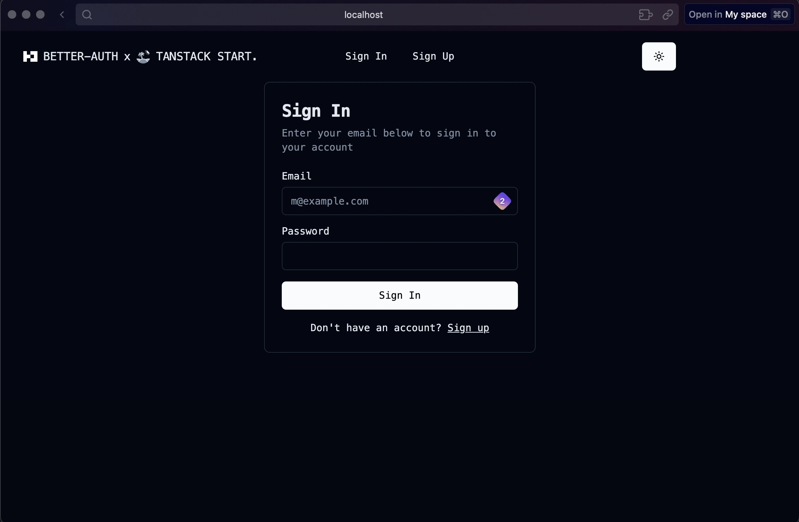

An example of using Better Auth with [TanStack Start](https://tanstack.com/start).

## Setup

1. Move .env.example to .env and provide necessary variables

2. install dependencies:

```bash
pnpm install
```

3. migrate required tables:

```bash
pnpx @better-auth/cli migrate
```

To run:

```bash
pnpm dev
```

## Preview
